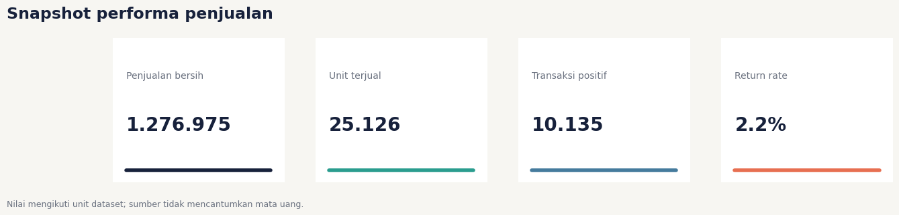
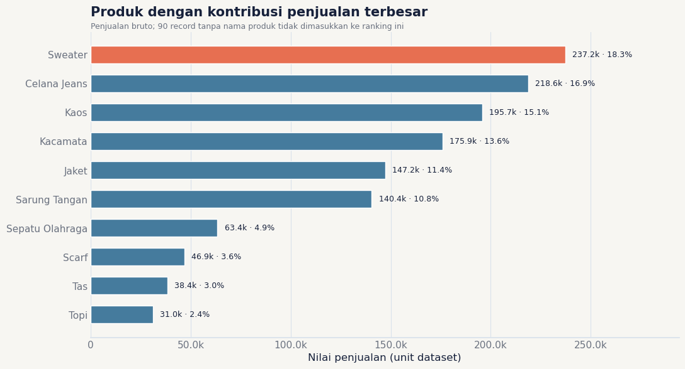
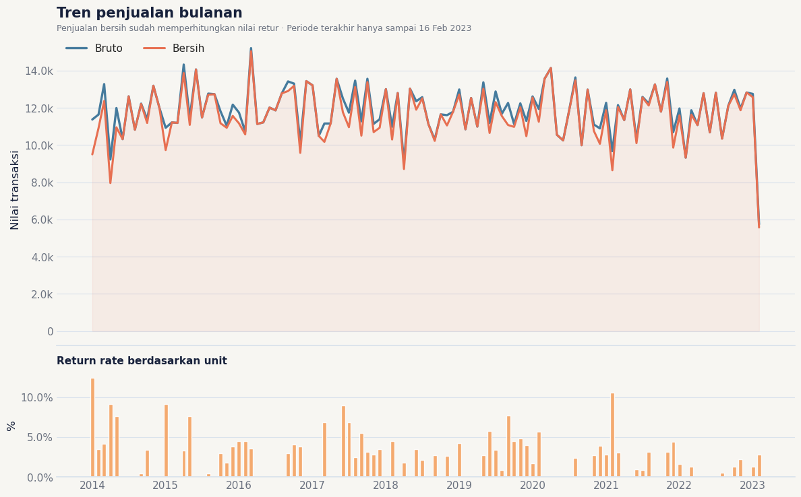
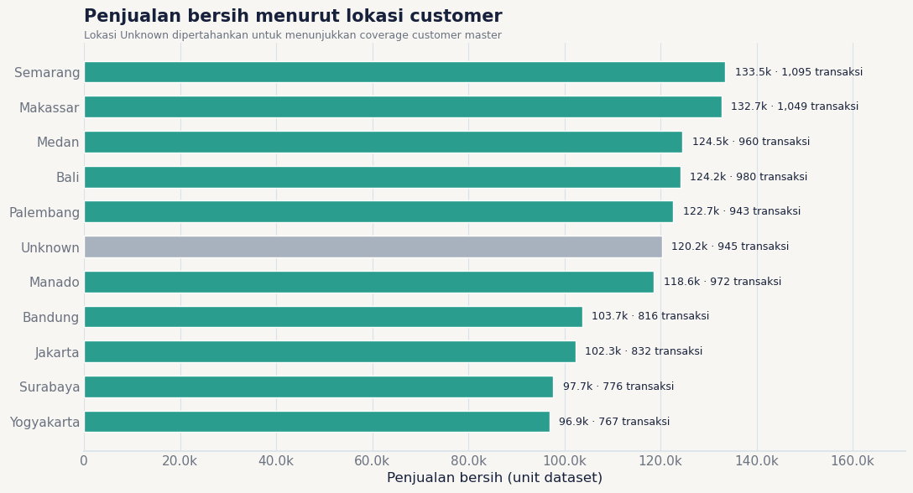

# Data Analyst Sales Showcase

Notebook showcase untuk menganalisis performa penjualan berdasarkan produk, waktu, lokasi, dan segmen pelanggan.

## Ringkasan

Notebook [`KP_01_KP_02_V2_showcase_revised.ipynb`](KP_01_KP_02_V2_showcase_revised.ipynb) merupakan revisi dari notebook coursework awal. Fokus revisinya adalah membuat analisis lebih reproducible, menjaga kualitas join dan cleaning, serta menyajikan visual yang lebih siap dibagikan.

### Pertanyaan analisis

- Produk mana yang paling besar kontribusinya?
- Bagaimana pola penjualan dan retur sepanjang waktu?
- Lokasi mana yang memiliki penjualan bersih terbesar?
- Bagaimana kontribusi penjualan menurut kelompok usia dan gender?

## Temuan utama

Hasil di bawah berasal dari eksekusi notebook dengan dataset sumber:

- Nilai penjualan bersih: **1.276.975 unit dataset**.
- Unit terjual: **25.126** dengan return rate berbasis unit **2,2%**.
- **Sweater** menjadi produk dengan kontribusi terbesar, yaitu **18,3%** di antara produk yang teridentifikasi.
- **Semarang** menjadi lokasi dengan penjualan bersih terbesar.
- Data valid berjalan dari **1 Januari 2014 sampai 16 Februari 2023**; Februari 2023 merupakan periode parsial.

> Dataset tidak mencantumkan mata uang, sehingga nilai di notebook diberi label *unit dataset*.

## Perbaikan metodologi

- Menghapus dependensi Google Colab upload/download dan menggunakan konfigurasi path dataset.
- Memperbaiki parsing tanggal campuran (`YYYY-MM-DD` dan `YYYY/MM/DD`).
- Mengonversi nilai harga `fifty` menjadi `50` sebelum kalkulasi.
- Mengonsolidasikan 96 duplicate customer ID sebelum join agar tidak terjadi row multiplication.
- Mempertahankan retur, customer yang tidak ditemukan, dan produk tidak diketahui sebagai bagian dari data-quality story.
- Tidak menghapus 373 exact duplicate sales rows secara otomatis karena sumber tidak memiliki transaction ID.

## Visual yang tersedia

- Executive KPI cards.
- Ranked horizontal bar untuk kontribusi produk.
- Tren penjualan bruto vs bersih dan return rate bulanan.
- Penjualan bersih menurut lokasi.
- Komposisi penjualan menurut kelompok usia dan gender.
- Heatmap kontribusi produk × lokasi.

## Preview visual

Figur berikut diekspor dari output notebook yang sudah dieksekusi. Nilai menggunakan unit dataset karena sumber tidak mencantumkan mata uang.

### Snapshot performa



### Kontribusi produk



### Tren bulanan dan return rate



> Catatan: Februari 2023 hanya mencakup data sampai 16 Februari sehingga merupakan periode parsial.

### Performa menurut lokasi



## Cara menjalankan

1. Install dependency:

   ```bash
   pip install -r requirements.txt
   ```

2. Letakkan tiga file CSV di folder `data/` dengan nama:

   ```text
   data/customers.csv
   data/products.csv
   data/sales.csv
   ```

   Dataset mentah tidak disertakan di repository ini. Notebook juga memiliki fallback path lokal yang bisa diubah pada cell setup.

3. Jalankan notebook:

   ```bash
   jupyter lab
   ```

   Atau eksekusi dari terminal:

   ```bash
   jupyter nbconvert --to notebook --execute --inplace KP_01_KP_02_V2_showcase_revised.ipynb
   ```

## Struktur repository

```text
.
├── KP_01_KP_02_V2_showcase_revised.ipynb
├── README.md
├── requirements.txt
├── .gitignore
└── assets/
    ├── kpi_snapshot.png
    ├── product_contribution.png
    ├── monthly_trend.png
    └── location_sales.png
```

## Batasan interpretasi

Analisis ini bersifat deskriptif. Hasil tidak membuktikan kausalitas, profitabilitas, atau optimalisasi stok. Keputusan lanjutan perlu mempertimbangkan mata uang, margin, biaya, transaction ID, dan snapshot inventory berbasis waktu.
